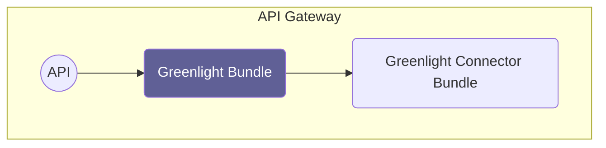

# Overview

Source: https://github.com/digital-blueprint/dbp-relay-greenlight-bundle

This bundle provides the backend services required for the greenlight
application. Part of the service is fetching a photo of the user for visual
authentication. This part is not implemented directly but outsourced to a
connector bundle which you have to install separately.

## Installation Requirements

* A SQL database like MySQL, PostgreSQL or similar.
